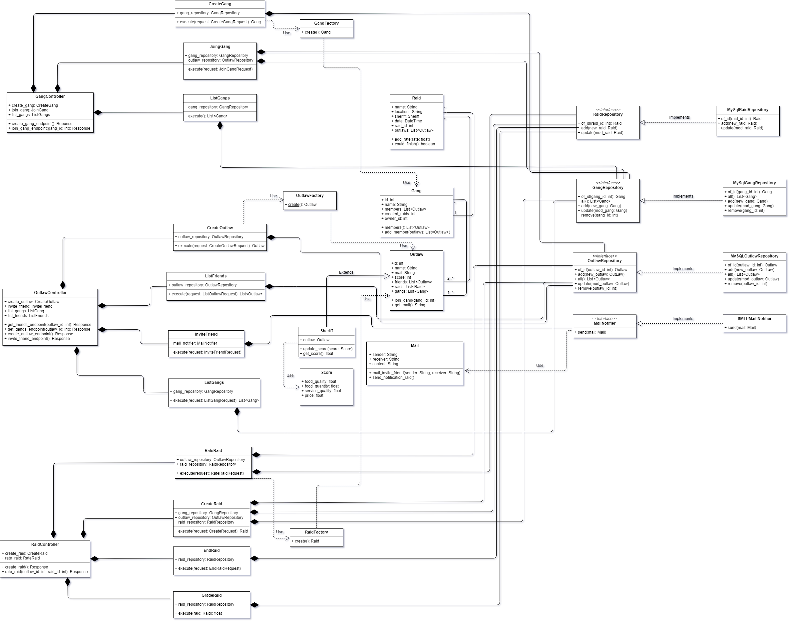
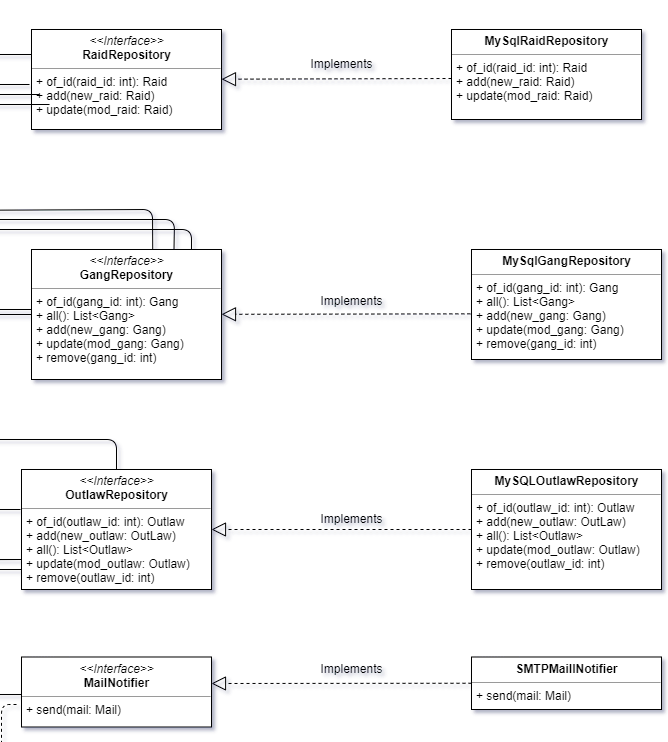

================
Tools
================

This section is intended to explain the technologies used in **The Sheriff** to implement the **infrastructure** details
of the application.

These tools are located in the *Infrastructure* layer of the *Hexagonal Architecture*, and they have relation with
other classes located in the *Domain* layer. These relations are implementations of **contracts**, and these fulfillment
of contracts will also be explained in the last point of this section.

Also, an impact analysis of what happens if a technology is switched by another one will be done, in order to
analyse the modularity of the system.

Docker
------
The whole sheriff application is based in Docker.
Docker is an application that allows to build, share and run any application, anywhere, letting the user to skip
the heavy work of installing all the required SW to run the main application in one or many computers.

*The Sheriff* application is built in a container that includes all the tools that the application will need to run,
and the database will be built into another container in order to persist the information of the game.

*The Sheriff* is configured in *Dockerfile.thesheriff* file, and the *MariaDB* database is downloaded as a *Docker*
image.

The configuration between containers have been done in the *docker-compose.yml* and triggered through the *Makefile*.

*The Sheriff* configuration looks like:

.. image:: ../images/Docker.png
   :height: 150
   :width: 300
   :scale: 300
   :alt: Docker configuration

Docker and Docker-Compose allows the application to have a huge modularity. If anytime the client wants to change, for
example, the database, just switching this image for another database image will be enough to keep persisting the
information.

Summarizing, Docker has been chosen for:

- Its **modularity**

- To **save configuration time**

Reference website:
`Docker <https://www.docker.com/>`_

Curl
----
Curl is an open source application used in command lines or scripts to transfer data.

In *The Sheriff*, *curl* is used to feed the specified *Controller*, located in the *Infrastructure* layer.

Curl let the user to provide information and trigger the desired application use case.

For example, to create an outlaw, the user should write in the command line::

    $ curl localhost:5000/api/<version>/outlaw/ \\
            -X POST --data @examples/json/create_outlaw.json \\
            -H 'Content-Type: application/json'

This use case triggering will be done posting a concrete JSON content in the specified URL.

Summarizing, Curl has been chosen to:

- **Allow communication** between the **user** and the **application** (specifically in this direction)

Reference website:
`Curl <https://curl.haxx.se/>`_

Python
------
Python is an open source programming language, friendly to use, easy to learn, and very integrable with a lot of
third-party applications.

All *The Sheriff* application is programmed in *Python*.

Basically, it has been chosen to use *Python* due to its *simplicity* and mostly for its *third-party applications*.
In the next lines it is going to be explained these other python applications used to implement all the other
infrastructure details.

If anytime the client desires to change this technology, the application would be **very compromised**, at some point
that we will have to change all the logic of the application (including the whole infrastructure logic).

Reference website:
`Python <https://www.python.org//>`_

Flask
~~~~~
Flask is a web application framework. It allows the developer to choose the libraries desired to implement the
web-application relationship.

In *The Sheriff*, it has let the infrastructure to deal with th information got from the user to send it later to
the application, that depending on the use case, this information will go again to another infrastructure service, for
example, to persist it.

Regarding these libraries, in the application they have been used:
- *Blueprints* to deal with the information received from command line

- *Flask Responses* and *Requests* returned and dispatched to control the calls in several functions

- *Jsonify* to deliver responses to other classes in JSON format.

Reference website:
`Flask <https://www.palletsprojects.com/p/flask/>`_

SQLAlchemy
~~~~~~~~~~
SQLAlchemy is a Python SQL toolkit. It allows the developer to use in a friendly way the SQL database through
persistence patterns.

In *The Sheriff*, it has let the application to persist all the information dealt in the concrete use case.

The libraries used are:
- *Create_engine* to enable the connection to the MySQL repositories.

- *MetaData* to share this object type to many SQL repositories.

- *Table* to abstract the way to deal with the SQL repositories. It allows to deal with Object Collections
as if they were tables.

Reference website:
`SQLAlchemy <https://www.sqlalchemy.org/>`_

Smtplib
~~~~~~~
The smtplib module is an SMTP client to send mails to any Internet machine with an SMTP listener daemon.
It uses RFC 821 (Simple Mail Transfer Protocol) and RFC 1869 (SMTP Service Extensions).

In *The Sheriff* is the library used to send mails with the information required for the application, according
the use case that triggers the action.

Reference website:
`Smtplib <https://docs.python.org/3/library/smtplib.html>`_

Contracts
---------

These aforementioned technologies are implemented in some infrastructure classes. These classes have implemented
some *contracts*: interfaces defined in the Domain layer.

Taking a look in the class diagram, it can be observed all the contracts in *The Sheriff*.

Zooming in the Infrastructure layer, it can be seen the implementation of these concrats:

In conclusion, to fulfill all the actions contained, for example, in the "XXXX_Raid" use case, the use case will
lead to execute a method in the *RaidRepository* and this contract will be implemented in the *MySQLRaidRepository*.

And this conclusion can be extended for the rest of the classes seen in the last diagram.

